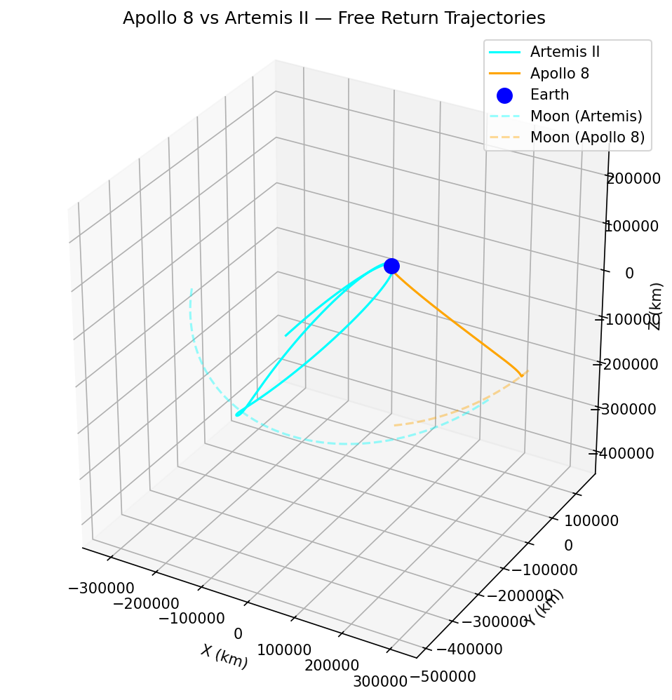
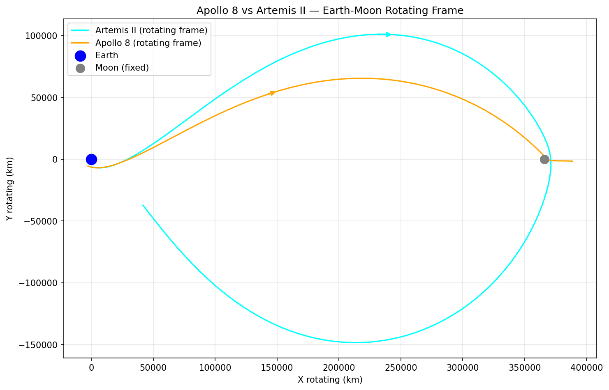

# free-return

A restricted three-body lunar trajectory simulator comparing the Apollo 8 and Artemis II translunar trajectories. Built from scratch in Python using real mission data and JPL ephemeris.

---

## Background

A free-return trajectory is a translunar path engineered so that a spacecraft will naturally loop around the Moon and return to Earth using only gravity, no major engine burns required after the initial translunar injection. Both Apollo 8 (1968) and Artemis II (2026) flew variations of this trajectory, but with meaningful differences: Apollo 8 required a lunar orbit insertion burn to enter orbit around the Moon before returning, while Artemis II flew a pure free-return flyby with no lunar orbit insertion.

This project propagates both trajectories using a restricted three-body model (Earth + Moon + spacecraft) and visualizes them in both the inertial ECI frame and the Earth-Moon rotating (synodic) frame, where the characteristic free-return shape becomes apparent.

---

## What the Model Does

- **Propagator:** `scipy.integrate.solve_ivp` with RK45, `rtol=1e-9`, `atol=1e-12`
- **Gravitational model:** Earth point-mass + Moon point-mass (restricted three-body)
- **Moon position:** JPL DE421 ephemeris via Skyfield — queried at each integrator timestep
- **Artemis II initial state:** Sourced from the mission OEM file at TLI epoch (`2026-04-02T23:56:22 UTC`)
- **Apollo 8 initial state:** Converted from polar to ECI using flight path angle, heading, geodetic latitude, and longitude per *Boeing Postflight Trajectory AS-503, Table 3-V*
- **Dense output:** Enabled for continuous trajectory evaluation at arbitrary time points

---

## Validation

Internal consistency was verified by checking conservation laws over the propagated arc and comparing the numerical period against the analytical Kepler period.

### Energy Conservation

| Metric | Value |
|---|---|
| Min specific energy | −0.858190868 MJ/kg |
| Max specific energy | −0.858190853 MJ/kg |
| Fractional drift (ε) | 1.53 × 10⁻⁸ (~1 part in 65 million) |

### Angular Momentum Conservation

| Metric | Value |
|---|---|
| Min \|h\| | 71,868.248068 km²/s |
| Max \|h\| | 71,868.248112 km²/s |
| Fractional drift | 6.18 × 10⁻¹⁰ (~1 part in 1.6 billion) |

### Kepler Period Cross-Check

| Metric | Value |
|---|---|
| Analytical Kepler period | 7,121.08 s |
| Numerical period | 7,116.86 s |
| Error | 0.059% |

These results confirm that the integrator is maintaining physical consistency at tight tolerances across the full propagation arc.

---

## Results

### OEM Overlay — Artemis II

The propagated trajectory was compared against the Artemis II OEM reference data over the translunar coast:

| Metric | Value |
|---|---|
| Error at 300,000 s (~3.5 days) | 3,790 km |
| Mean position error (full arc) | 27,643 km |
| Max position error | 169,688 km |

Position error remains low through approximately day 3.5, then diverges sharply. This is consistent with the first unmodeled correction burn (OTC-2) occurring near closest lunar approach, after which the ballistic model and the actual trajectory separate. The model captures the outbound translunar coast accurately; it does not attempt to replicate post-flyby maneuvers.

### Apollo 8 Closest Lunar Approach

| Metric | Value |
|---|---|
| Modeled closest approach | 930 km |
| Actual closest approach | ~112 km |

The ~818 km discrepancy reflects the ballistic nature of the model. Apollo 8's actual trajectory included a lunar orbit insertion burn that tightened the approach. The model captures the outbound translunar coast geometry accurately; the departure from actual closest approach distance is expected and understood.

---

## Figures

### Inertial Frame (ECI)
Both trajectories in Earth-Centered Inertial coordinates. Earth at origin; dashed lines show the Moon's position over each mission's timeframe.



### Rotating Frame (Synodic)
Both trajectories transformed into the Earth-Moon rotating frame, where the Moon is fixed on the positive x-axis. The free-return shape is visible in this frame: Artemis II completes the full outbound-flyby-return arc over 8.5 days; Apollo 8 shows the outbound translunar coast over 3 days before the unmodeled LOI burn.



---

## Limitations

- **Ballistic model only** — no delta-V burns modeled (no OTC-2/RTC-1 for Artemis II, no LOI for Apollo 8)
- **Point-mass gravity** — no solar gravity, no lunar oblateness, no SRP
- **Apollo 8 outbound only** — 3-day propagation to closest lunar approach; return leg not modeled due to LOI burn dependency
- **Artemis II** — 8.5-day propagation from TLI epoch captures the full free-return arc; small correction burns cause gradual divergence from the actual trajectory after closest approach

---

## Dependencies

```
numpy
scipy
matplotlib
skyfield
```

Install with:
```bash
pip install numpy scipy matplotlib skyfield
```

The Skyfield ephemeris file (`de421.bsp`) will download automatically on first run.

---

## How to Run

```bash
# Inertial frame plot + Apollo 8 closest approach validation
python3 propagator.py

# OEM overlay and error analysis (requires Artemis II OEM file)
python3 compare.py

# Earth-Moon rotating frame comparison plot
python3 rotating_frame.py

# Conservation law and Kepler period validation
python3 verify.py
```

---

## Data Sources

- **Artemis II OEM:** NASA AROW (Artemis Real-time Orbit Website), publicly available mission trajectory data, April 2026
- **Apollo 8 TLI state:** *Saturn V Launch Vehicle Flight Evaluation Report AS-503*, Boeing, Table 3-V
- **Moon ephemeris:** JPL DE421 via [Skyfield](https://rhodesmill.org/skyfield/)
